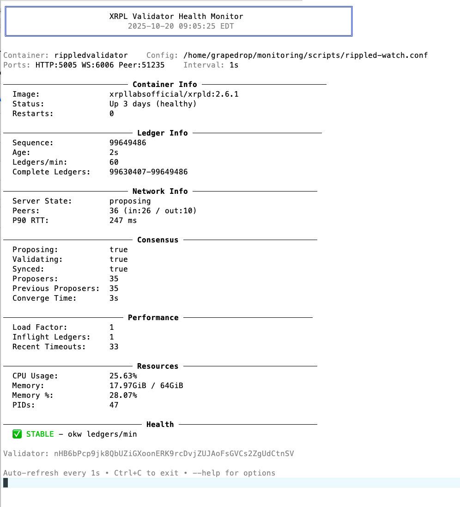
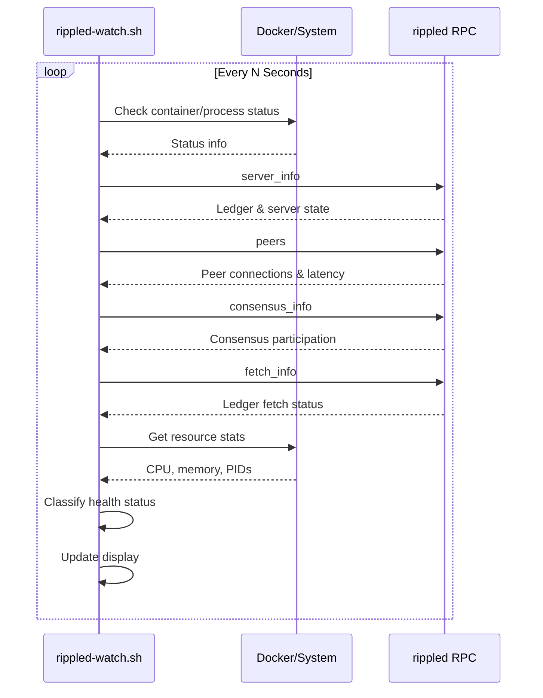

# XRPL Validator Health Monitor

A lightweight, real-time monitoring tool for XRPL (XRP Ledger) validator nodes. This terminal-based monitor provides instant visibility into your validator's health, consensus participation, network connectivity, and resource usage.



## 🌟 Features

- **Real-time Monitoring** - Smooth, flicker-free terminal updates with configurable refresh intervals
- **Dual Deployment Support** - Works with both Docker containers and native rippled installations
- **Comprehensive Metrics** - Tracks ledger sync, consensus state, peer connections, and resource usage
- **Health Classification** - Automatic health status assessment (Stable/Watch/Trouble)
- **Zero Configuration** - Interactive setup wizard on first run
- **Portable** - Run from anywhere on your system
- **JSON Output Mode** - Machine-readable output for integration with other tools

## 📋 Table of Contents

- [Prerequisites](#-prerequisites)
- [Installation](#-installation)
- [Quick Start](#-quick-start)
- [Configuration](#-configuration)
- [Usage](#-usage)
- [Metrics Explained](#-metrics-explained)
- [Health Status](#-health-status)
- [How It Works](#-how-it-works)
- [Troubleshooting](#-troubleshooting)
- [Uninstallation](#-uninstallation)
- [Contributing](#-contributing)
- [License](#-license)

## 🔧 Prerequisites

### Required

- **Linux/Unix System** - Tested on Ubuntu 20.04+
- **rippled** - Must be running locally (Docker or native)
- **jq** - JSON processor for parsing rippled output
- **bash** - Version 4.0 or higher

### Installation of Dependencies

```bash
# Ubuntu/Debian
sudo apt-get update
sudo apt-get install -y jq

# For Docker deployments
sudo apt-get install -y docker.io
```

## 📥 Installation

### Method 1: Quick Install (Recommended)

```bash
# Download the script
curl -O https://raw.githubusercontent.com/realgrapedrop/xrpl-rippled-watch/main/rippled-watch.sh

# Make it executable
chmod +x rippled-watch.sh

# Run it (will prompt for configuration on first run)
./rippled-watch.sh
```
### Optional: System-wide Installation
For permanent deployment or running as a command from anywhere:

```bash
# Download the installer
curl -O https://raw.githubusercontent.com/realgrapedrop/xrpl-rippled-watch/main/install.sh

# Install for system wide installation
chmod +x install.sh
sudo ./install.sh

# Now available from any directory
rippled-watch
```

### Method 2: Clone Repository

```bash
# Clone the repository
git clone https://github.com/realgrapedrop/xrpl-rippled-watch.git

# Navigate to directory
cd xrpl-rippled-watch

# Make script executable
chmod +x rippled-watch.sh

# Run the monitor
./rippled-watch.sh
```

### Method 3: System-wide Installation

```bash
# Clone and run installer
git clone https://github.com/realgrapedrop/xrpl-rippled-watch.git
cd xrpl-rippled-watch
sudo ./install.sh

# Run from anywhere
rippled-watch
```

## 🚀 Quick Start

### First Run

When you run the script for the first time, it will:

1. **Check for local rippled** - Verifies rippled is running on the same machine
2. **Detect deployment type** - Asks if you're using Docker or native installation
3. **Configure ports** - Prompts for HTTP RPC, WebSocket, and Peer ports
4. **Save configuration** - Creates `rippled-watch.conf` in the script directory

```bash
./rippled-watch.sh
```

Example first-run interaction:

```
================================================
  XRPL Validator Monitor - First Run Setup
================================================

Checking for local rippled installation...
✓ Local rippled detected

This will create a config file: /path/to/rippled-watch.conf

How is rippled deployed on this system?
  1) Docker container (default)
  2) Native (installed directly on system)

Select deployment type [1]: 1

Docker Deployment Configuration
─────────────────────────────────

Available rippled containers:
  • rippledvalidator (Up 2 days)

Container name [rippledvalidator]: 

Port Configuration
──────────────────
HTTP RPC Port [5005]: 
WebSocket Port [6006]: 
Peer Port [51235]: 
Refresh interval in seconds [5]: 1

Configuration saved to: /path/to/rippled-watch.conf

Setup complete! Starting monitor...
```

## ⚙️ Configuration

### Configuration File

The script creates a `rippled-watch.conf` file in the same directory:

```bash
# Rippled Watch Configuration
# Generated: 2025-10-20

# Deployment type: docker or native
DEPLOYMENT="docker"

# Container name (only used if DEPLOYMENT=docker)
CONTAINER="rippledvalidator"

# Refresh interval (seconds)
INTERVAL=5

# Rippled ports
HTTP_PORT=5005
WS_PORT=6006
PEER_PORT=51235

# Rippled binary path (only used if DEPLOYMENT=native)
RIPPLED_BIN=""

# Rippled config path (only used if DEPLOYMENT=native)
RIPPLED_CFG=""
```

### Reconfiguration

To change settings after initial setup:

```bash
./rippled-watch.sh --reconfig
```

### Manual Configuration

You can also manually edit the `rippled-watch.conf` file with your preferred text editor.

## 💻 Usage

### Basic Usage

```bash
# Run with default settings (from config file)
./rippled-watch.sh

# Run with 1-second refresh
./rippled-watch.sh --interval 1

# Run with specific container
./rippled-watch.sh --container myvalidator
```

### Command Line Options

```
Options:
  --interval, -i N     Seconds between refresh (default: from config or 5)
  --container NAME     Container name (default: from config or 'rippledvalidator')
  --no-clear          Don't clear screen each tick (scrolling log mode)
  --json              Output JSON lines instead of TUI
  --reconfig          Re-prompt for all configuration values
  --help, -h          Show help message
```

### JSON Output Mode

For integration with logging systems or custom dashboards:

```bash
./rippled-watch.sh --json | tee rippled-health.log
```

Example JSON output:

```json
{
  "timestamp": "2025-10-20T08:31:10-04:00",
  "container": "rippledvalidator",
  "image": "xrpllabsofficial/xrpld:2.6.1",
  "status": "Up 2 days (healthy)",
  "server_state": "proposing",
  "rpc_ready": true,
  "validator_pubkey": "nHB6bPcp9jk8QbUZiGXoonERK9rcDvjZUJAoFsGVCs2ZgUdCtnSV",
  "complete_ledgers": "99630407-99648954",
  "ledger_seq": 99648954,
  "ledger_age_s": 1,
  "ledgers_per_min": 60,
  "load_factor": 1,
  "converge_time_s": 3,
  "previous_proposers": 35,
  "proposers": 11,
  "proposing": true,
  "synced": true,
  "validating": true,
  "peers": {
    "total": 36,
    "inbound": 26,
    "outbound": 10,
    "p90_rtt_ms": 279
  },
  "fetch": {
    "inflight_ledgers": 2,
    "recent_timeouts": 53
  },
  "docker": {
    "cpu": "12.82%",
    "mem": "17.95GiB / 64GiB",
    "mem_perc": "28.05%",
    "pids": "35"
  },
  "health": {
    "status": "stable",
    "reason": "ok"
  }
}
```

## 📊 Metrics Explained

### Container Info

| Metric | Description |
|--------|-------------|
| **Image** | Docker image name and version (Docker mode only) |
| **Status** | Container status or "native installation" |
| **Restarts** | Number of container restarts (Docker mode only) |

### Ledger Info

| Metric | Description | Healthy Range |
|--------|-------------|---------------|
| **Sequence** | Current validated ledger sequence number | Incrementing |
| **Age** | Seconds since last validated ledger | < 20s |
| **Ledgers/min** | Rate of ledger validation | ~60 (1 per ~3-4s) |
| **Complete Ledgers** | Range of ledgers stored locally | Continuous range |

### Network Info

| Metric | Description | Healthy Range |
|--------|-------------|---------------|
| **Server State** | Current operational state (see states below) | proposing, validating, full |
| **Peers** | Total/inbound/outbound peer connections | > 10 total |
| **P90 RTT** | 90th percentile peer round-trip time | < 300ms |

#### Server States

States are listed from least to most ready:

- `disconnected` - Not connected to network
- `connected` - Network connected, syncing
- `syncing` - Downloading ledgers
- `tracking` - Following network, not yet proposing
- `full` - Fully synced, ready to validate
- `validating` - Validating ledgers
- `proposing` - Actively participating in consensus (target state)

### Consensus

| Metric | Description |
|--------|-------------|
| **Proposing** | Whether this validator is proposing transactions |
| **Validating** | Whether this validator is validating ledgers |
| **Synced** | Whether synced with the network |
| **Proposers** | Number of active proposers seen |
| **Previous Proposers** | Number of proposers in previous round |
| **Converge Time** | Seconds to reach consensus (typically 3-4s) |

### Performance

| Metric | Description | Healthy Range |
|--------|-------------|---------------|
| **Load Factor** | Server load multiplier | 1 (normal) |
| **Inflight Ledgers** | Ledgers currently being fetched | < 10 |
| **Recent Timeouts** | Recent fetch timeout count | < 100 |

### Resources

| Metric | Description |
|--------|-------------|
| **CPU Usage** | Percentage of CPU used |
| **Memory** | Memory usage (Docker: in container, Native: process RSS) |
| **Memory %** | Percentage of available memory |
| **PIDs** | Number of processes/threads |

## 🏥 Health Status

The monitor automatically classifies validator health into three categories:

### ✅ STABLE (Green)

Your validator is operating normally:
- Server state is `proposing` or `validating`
- Ledger age < 20 seconds
- Ledgers advancing at normal rate (> 5/min)
- Adequate peer connections (> 3)
- Load factor reasonable (< 4)

### ⚠️ WATCH (Yellow)

Your validator may need attention:
- Server state is `full`, `tracking`, or `syncing`
- Low ledger rate (< 5/min)
- High load factor (> 4)
- High peer latency (P90 > 300ms)
- Elevated fetch timeouts (> 100)

### ❌ TROUBLE (Red)

Your validator needs immediate attention:
- Server state is `disconnected` or unknown
- Ledger age > 20 seconds (stale)
- Very few peers (< 3)

## 🔄 How It Works

### Architecture

```
┌───────────────────────────────────────────────────────┐
│                   rippled-watch.sh                    │
│                                                       │
│  ┌──────────────┐         ┌──────────────┐            │
│  │   Terminal   │         │    Config    │            │
│  │     UI       │◄────────┤   Manager    │            │
│  └──────┬───────┘         └──────────────┘            │
│         │                                             │
│         ▼                                             │
│  ┌──────────────┐         ┌──────────────┐            │
│  │    Health    │         │  RPC Client  │            │
│  │  Classifier  │◄────────┤   (Docker/   │            │
│  └──────────────┘         │   Native)    │            │
│                           └──────┬───────┘            │
└──────────────────────────────────┼────────────────────┘
                                   │
                                   ▼
                    ┌──────────────────────────┐
                    │   rippled Validator      │
                    │                          │
                    │  ┌────────────────────┐  │
                    │  │  RPC Endpoints:    │  │
                    │  │  • server_info     │  │
                    │  │  • peers           │  │
                    │  │  • consensus_info  │  │
                    │  │  • fetch_info      │  │
                    │  └────────────────────┘  │
                    └──────────────────────────┘
```

### Data Collection Flow



### Key Operations

1. **Initialization**
   - Load or create configuration
   - Initialize terminal colors
   - Verify rippled is local

2. **Main Loop** (every N seconds)
   - Check container/process is running
   - Call rippled RPC endpoints
   - Parse JSON responses
   - Calculate derived metrics (ledgers/min)
   - Gather resource statistics
   - Classify health status
   - Update terminal display

3. **Display Update**
   - Move cursor to home (no screen clear)
   - Overwrite previous content
   - Clear any trailing lines
   - Result: smooth, flicker-free updates

## 🔧 Troubleshooting

### Script Won't Start

**Problem:** `ERROR: No rippled instance detected on this system.`

**Solution:** Ensure rippled is running locally:

```bash
# For Docker
docker ps | grep rippled

# For native
ps aux | grep rippled
# or
systemctl status rippled
```

**Problem:** `Missing 'jq'`

**Solution:** Install jq:

```bash
sudo apt-get install -y jq
```

### No Data Displayed

**Problem:** Script shows "Rippled RPC initializing..."

**Solutions:**
1. Wait 10-30 seconds for rippled to fully start
2. Verify RPC port is correct in config
3. Check rippled logs for startup issues

**For Docker:**
```bash
docker logs rippledvalidator
```

**For Native:**
```bash
journalctl -u rippled -f
# or
tail -f /var/log/rippled/debug.log
```

### Incorrect Metrics

**Problem:** Wrong container or ports shown

**Solution:** Reconfigure the script:

```bash
./rippled-watch.sh --reconfig
```

### Permission Denied

**Problem:** `permission denied` when running script

**Solution:** Make script executable:

```bash
chmod +x rippled-watch.sh
```

**Problem:** `permission denied` when accessing Docker

**Solution:** Add user to docker group:

```bash
sudo usermod -aG docker $USER
# Log out and back in
```

### Display Issues

**Problem:** Screen flickering or jumping

**Solution:** This was fixed in recent versions. Ensure you have the latest script.

**Problem:** Colors not displaying

**Solution:** Your terminal may not support colors, or `tput` is not available. The script will work but without colors.

### Container Not Found

**Problem:** Docker deployment but container not detected

**Solutions:**
1. Check container name:
   ```bash
   docker ps --format '{{.Names}}'
   ```
2. Update config with correct name:
   ```bash
   ./rippled-watch.sh --reconfig
   ```

### High Resource Usage from Script

**Problem:** Monitor consuming too much CPU

**Solution:** Increase refresh interval:

```bash
./rippled-watch.sh --interval 10
```

## 🗑️ Uninstallation

### Remove Script and Config

```bash
# Navigate to script directory
cd /path/to/xrpl-rippled-watch

# Remove script and config
rm rippled-watch.sh rippled-watch.conf

# If installed system-wide
sudo rippled-watch-uninstall
```

### Clean Uninstall Script

For your convenience, use the included uninstaller:

```bash
# From repository directory
sudo ./uninstall.sh

# Or if installed system-wide
sudo rippled-watch-uninstall
```

## 🤝 Contributing

Contributions are welcome! Please feel free to submit a Pull Request. For major changes, please open an issue first to discuss what you would like to change.

### Development Setup

```bash
# Clone the repository
git clone https://github.com/realgrapedrop/xrpl-rippled-watch.git
cd xrpl-rippled-watch

# Make changes to rippled-watch.sh

# Test your changes
./rippled-watch.sh --interval 1
```

### Reporting Issues

When reporting issues, please include:

1. **Script version** - First few lines of `rippled-watch.sh`
2. **Operating system** - `uname -a`
3. **rippled version** - From Docker image or `rippled --version`
4. **Deployment type** - Docker or native
5. **Error messages** - Full error output
6. **Steps to reproduce**

See [CONTRIBUTING.md](CONTRIBUTING.md) for detailed guidelines.

## 📄 License

This project is licensed under the MIT License - see the [LICENSE](LICENSE) file for details.

## 🙏 Acknowledgments

- **Ripple** - For the XRP Ledger and rippled software
- **XRPL Community** - For validation and feedback
- **Contributors** - Everyone who has helped improve this tool

## 📞 Support

- **Issues:** [GitHub Issues](https://github.com/realgrapedrop/xrpl-rippled-watch/issues)
- **Discussions:** [GitHub Discussions](https://github.com/realgrapedrop/xrpl-rippled-watch/discussions)
- **XRPL Documentation:** [xrpl.org](https://xrpl.org/)
- **XRPL Discord:** [XRPL Validators](https://discord.gg/xrpl)

---

**Note:** This is a monitoring tool only. It does not modify your rippled configuration or perform any administrative actions. It's read-only and safe to run alongside your validator.

**Disclaimer:** This tool is provided as-is. Always monitor your validator using multiple methods and don't rely solely on any single monitoring solution.
